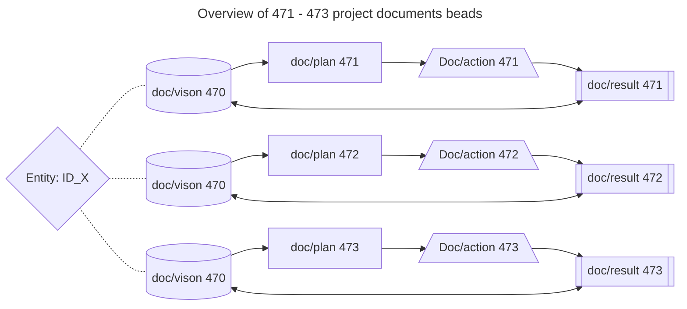

# Starting from scratch.md

# 1 Vision/Dream
- The long way back from the leaf to the tree root as loop feedback
- (47)[leaf ] => (02)[2] => (DIRNAME)[branch] => (0)[0] =>(tree)[root]
- elements: [leaf] => components: [2] => [branch] => [0] => [root]
- the leaf is the last element in the tree, and the root is the first element
## 1.1 The tree is a structure that contains elements and components
## 1.2 The leaf is the last element/component in the tree, and the root is the main object with an collection of components
## 1.3 the leaf contains multiple triple configurations of elements. it contains also as inheritage the blueprint of the tree. if the tree is damaged , the tree can be repared from the leaf. this can be done by loop feedback and true reverse engineering.
## 1.4 Input visuals of the actionplan

# 2 continue improvements approach
- random bundled triple steps improvements(with mathematical logic and precision), or guided triple steps improvements
## 2.1 the leaf containing the blueprint(beads) 
 should be cross pollinated with other leaves to improve/repair the branches/tree
- start with designed blueprint [47 mission plan](./47%20Mission%20Plan%20For%20Me%20And%20Entity%20X/473doc.md); ##2.1 output as input example for:
- use of templates/agents
- target for experiment is projectpart;
 - excluded from projectpart are:
  - root
  - branch files;
    - project progres_report,.git, projectplan, projectresult, projectconversation, projectvisuals, projecttemplates, src;
    - leaf
- results/visuals of the action.
## 2.1 Overview of 471 - 473 project documents beads
- core pricipals;
    1.  Vision/Plan/start
    2. Action/design/produce
    3. Result/output/takeaways
    reference: [470](./47%20Mission%20Plan%20For%20Me%20And%20Entity%20X/470doc.md)

# 3 results/visuals of the action.

## Goals
- overall health of the tree from root to leaf and overall improvement. DNA/blueprint of the tree is and should be uniform.
- each leaf,branch,root should have this basetype of Visualization to be monitored for health and improvement or to be transformed according this principle to be unified.
- unififying action should be chunking/splitting in as mas many needed tripple steps approach according this 47 project design principles, but keeping the begin source data intact from every file
- output should be at end of file or an new file with the same name as the input file, but with a suffix like _output.md or _result.md
## Visuals of this vision.
- in mermaid diagrams

