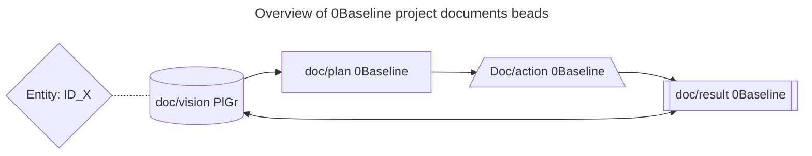

#  Baseline
- A collection of projects and experiments in various stages of development, including baseline, rookie, and arcade levels. Inspiration from AZR LLM, focusing on the journey from chaos to organized order. 
-  project principles/philosophy/framework
- results/visuals of the action.
## 1.1 Visions and Goals
- A collection of projects and experiments in various stages of development.  
It should be easy to digest for beginner to advanced users.  
This project should also invites potential contributors with different levels of skills for spreading and growing the project core principles.  

-  Overall health of the project tree from root to leaf and overall improvement.  
- DNA/blueprint of the tree is and should be uniform.
- each leaf,branch,root should have this base-type of Visualization to be monitored for health and improvement or to be transformed according this principle.
- unifying action should be chunking/splitting in as many needed triple steps approach according this 47 project design principles, but keeping the begin source data intact from every file.
- output should be at end of file or an new file with the same name as the input file, but with a suffix like _output.md or _result.md
- This project is built on the principles of clarity, organization, and incremental development.

## 1.2 principles of the engineering
- Visions and goals
- inspirations and motivations
- project plan and execution designs/philosophy;numerical approach:  
```
|123|123|123|
|---|---|---|
|123|123|123|
|123|123|123|
```
### 1.2.1 project-plan 
- start, action, end;

Complete build up in 1 project/container/context within 9 blocks;
| start            | action            | stop   |
|------------------|-------------------|--------|
| mission/intro    | plan/project/build | result |
| vision           | actions           | realization |
| target           | design/produce    | takeaways |

## 1.3 result/visuals  
each block should be exchangeable / replicable;
each parent-content/context can be detailed out in max 3 child levels.   
results in new Playground data for markdown.js  
for import in the Playground data repository;

### 1.3.1 Overview of 0Baseline project documents beads
- core principles;
    1.  Vision/Plan/start
    2. Action/design/produce
    3. Result/output/takeaways
- reference: [470](./47%20Mission%20Plan%20For%20Me%20And%20Entity%20X/470doc.md)
    



# 3 results/visuals of the action.

## Visuals of this vision.
- in mermaid diagrams


# 45.2 Vision Bubbles From Dreams to Creation Flow
## 1 work in progress Class diagram
### inspirations
From chaos to organized order, from real life situations to organized project order.
I want to highlight the partly flow of "dreams" to "creation" in another graph like flowchart and elaborate on it.
I want to visualize this in mermaid graphs.
AZR LLM Inspiration /visions;
- Started with a Main overview Mermaid graph "45 Vision Bubbles From Chaos to Order" as a baseline.
- Goal: Visions Representation in Mermaid Graphs "45.2 Vision Bubbles From Dreams to Creation Flow" Based On AZR LLM Inspiration /Visions.


## 2.1 Work in Progress Flowchart (Update)

 Based On AZR LLM Inspiration /Visions.

# Playground Project Environment
- The project is hosted on GitHub, with a structured approach to development and documentation.
- Site is hosted at:  
https://github.com/RoysSpaceXL/Playground/blob/0BaseLine/0BaseLine/45.2%20Vision%20Bubbles%20From%20Dreams%20to%20Creation%20Flow.md  

- or link: [0Baseline; From Dreams to Creation Flow](/0BaseLine/45.2%20Vision%20Bubbles%20From%20Dreams%20to%20Creation%20Flow.md)
- The site is live at https://roysspacexl.github.io/Playground/

# Playground Project Overview
- Triple steps approach to project development:
  - **0Baseline**: Initial project setup and basic structure.
  - **1Rookie**: Intermediate development with added features and improvements.
  - **2Arcade**: Advanced stage with full functionality and polish.
# 0Baseline
- The initial stage of the project, focusing on setting up the basic structure and functionality.
- It is also built up in triple steps:
  ## Project/Object description
  - Intro, vision, and goals.
  - start with project planning and basic setup.  
       Define the project scope and objectives.
  - Result: A clear project plan and initial setup.
  ## 1 Start execution
  - Implement the project plan.
   Develop the core features and functionality.
  ## 2 Create/Finalize
  - Test and validate the project outcomes.  
   Gather feedback and make improvements.
  ## 3 Results/Review/Takeaways
  - Finalize the project deliverables.
  - results and documentation.
  - Prepare for project closure and handover.
# Playground Project Overview
- This project is structured to provide a clear and organized approach to development, with each stage building upon the previous one.
- The goal is to create a comprehensive and functional project that meets the defined objectives and provides value to users.
## Project Structure

```
Playground
├── 0Baseline
│   │ gitattributes
│   ├── Project_basics.md
│   ├── Project_Progress.md
│   ├── Project_Prompt_input.txt
│   ├── project_Start.md
│   ├── README.md              
│   ├── Vision Bubbles From Chaos to Order.md
│   ├── 45.2 Vision Bubbles From Dreams.md
│   └── LICENSE                 # Project license
├── README.md                   # Main project documentation
└── .vscode
    └── settings.json           # VS Code & Mermaid settings
```

This structure now accurately reflects:

All visible folders including 0Baseline, 
Root level files like gitattributes
Maintains proper Markdown formatting

- This repository is hosted at:  
https://github.com/RoysSpaceXL/Playground
- The site is live at https://roysspacexl.github.io/Playground/
## 2.8 Sources;
```html
Tensor Art Website; https://tensor.art/models  
Genspark;           https://www.genspark.ai/  
mermaid;            https://mermaid.js.org/  
Markdown CDN Tool;  https://cdn.jsdelivr.net/npm/marked/
