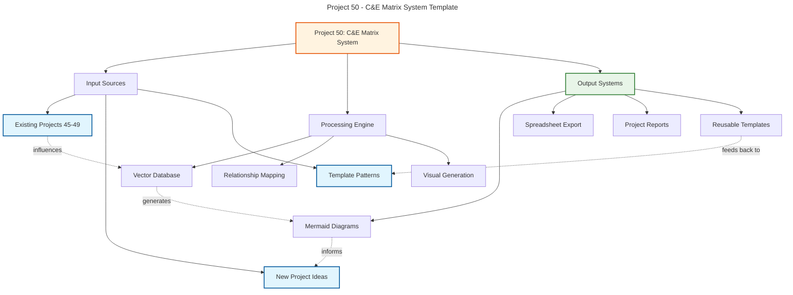
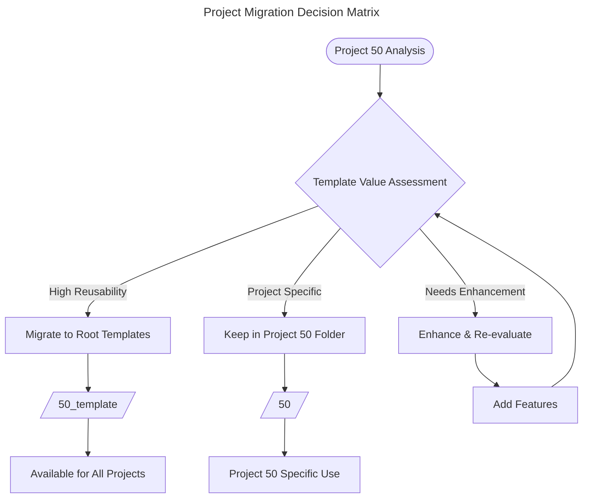
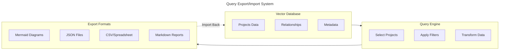

#  Views and Principles
- 99 Project Views/Visions possibilities to create related to one big Object/subject/bubble/Mission/DreamVision/Cycle
- Define the overarching vision and mission for the projects.
## User-Centric Design
- Prioritize user needs and experiences in all design decisions.
- Conduct user research and usability testing to inform design choices.

## Accessibility
- Ensure all users, regardless of ability, can access and use the product.
- Follow WCAG guidelines and best practices for inclusive design.

## Consistency
- Maintain a cohesive visual and functional design across all product areas.
- Use established design patterns and components to promote familiarity.

## Flexibility
- Design for a range of devices and screen sizes, from mobile to desktop.
- Allow for user customization and personalization where appropriate.

## Performance
- Optimize design and code for fast loading times and smooth interactions.
- Regularly test and refine the product to ensure high performance.

## Collaboration
- Foster open communication and collaboration between design, development, and other teams.
- Involve stakeholders in the design process to gather diverse perspectives.

## Iteration
- Embrace an iterative design process, allowing for continuous improvement.
- Use feedback and data to inform design updates and refinements.

# 1 Brainwaves/ Visions
- Encourage innovative thinking and creative problem-solving.
- Explore new technologies and design trends to inspire fresh ideas.
# 45 Mermaid Diagrams
- Use Mermaid diagrams to visualize complex processes and systems.
- Create flowcharts, sequence diagrams, and other visual representations to aid understanding.
# 46 WorkCycles
- Map out workflows and processes to identify inefficiencies and areas for improvement.
- Use visual tools to communicate complex workflows clearly.
# 47 Mission Plan
- Define clear objectives and goals for the project.
- Outline key tasks, milestones, and deliverables.
- Assign responsibilities and establish timelines.
# 48 Profile For Entity X
- Create detailed user profiles to guide design decisions.
- Use personas to represent different user types and their needs.
# 49 WorkFlowVisuals
- Create visual representations of workflows to aid understanding and communication.
- Use flowcharts, diagrams, and other visual tools to map out processes.
# 50 The Matrix / C&E Diagram
- Challenge conventional thinking and explore alternative perspectives.
- Use visual storytelling to communicate complex ideas and concepts.
- The relatable Table/spreadsheet/database with all relevant information and 
  insights in the visualform of an Cause and Effect matrix/diagram

## 50.0 Project Database Structure Template
```json
{
  "project_metadata": {
    "project_id": "50",
    "name": "The Matrix / C&E Diagram System",
    "type": "template_system",
    "status": "development",
    "parent_folder": "root_templates",
    "migration_ready": true
  },
  "database_schema": {
    "projects": {
      "id": "string",
      "name": "string", 
      "description": "text",
      "status": "planning|active|completed|on-hold|template",
      "folder_number": "integer",
      "stakeholders": ["array"],
      "dependencies": ["project_ids"],
      "cause_effect_factors": ["array"],
      "mermaid_diagrams": ["file_paths"],
      "relationships": {
        "influences": ["project_ids"],
        "influenced_by": ["project_ids"],
        "parallel_to": ["project_ids"]
      }
    }
  }
}
```

## 50.0.1 Cause & Effect Matrix Template


# 50.1. Identify key variables and their relationships.
- Determine the main factors that influence the project.

## 50.1.0 Project Registry & Migration Logic


## 50.1. List of Projects and Subprojects
- Analyze how these variables interact with each other.

### 50.1.1 Comprehensive Project Database Structure
```json
{
  "project_list": [
    {
      "id": "45",
      "name": "Vision Bubbles From Chaos to Order",
      "folder": "45/",
      "status": "completed",
      "key_files": ["45.2 Vision Bubbles From Dreams to Creation Flow.md"],
      "relationships": {
        "influences": ["46", "47"],
        "template_potential": "high"
      }
    },
    {
      "id": "46", 
      "name": "Work Cycles & Document Chaining",
      "folder": "46/",
      "status": "active",
      "key_files": ["46.1 Chaining a doc.md"],
      "relationships": {
        "influenced_by": ["45"],
        "influences": ["47", "48"]
      }
    },
    {
      "id": "47",
      "name": "Mission Plan For Me And Entity X", 
      "folder": "47 Mission Plan For Me And Entity X/",
      "status": "completed",
      "key_files": ["47.2 From Dreams to Creation Flow.md", "470doc.md", "471doc.md", "472doc.md", "473doc.md"],
      "relationships": {
        "influenced_by": ["45", "46"],
        "influences": ["48", "50"]
      }
    },
    {
      "id": "48",
      "name": "Profile For Entity X",
      "folder": "48 Profile For Entity X/", 
      "status": "active",
      "key_files": ["48 Profile Entity_X.md", "483 Folder Visualization.md"],
      "relationships": {
        "influenced_by": ["47"],
        "influences": ["50"]
      }
    },
    {
      "id": "50",
      "name": "The Matrix / C&E Diagram System",
      "folder": "50/",
      "status": "development",
      "migration_candidate": true,
      "template_potential": "very_high"
    }
  ]
}
```

### 50.1.2 Vector Database Implementation
- **Purpose**: Store all relevant information and insights in visual form of Cause-and-Effect matrix/diagram
- **Structure**: Multi-dimensional relationship mapping
- **Query Capabilities**: Direct export/import from/to project files
- **Visualization**: Automatic Mermaid diagram generation

### 50.1.3 Export/Import System Design


# 50.2. Create a Cause-and-Effect diagram.
# 50.2. Map out Cause-and-Effect connections.
- Create a visual representation of how different elements impact one another.
- Use arrows and labels to clarify relationships.
# 50.3. Use visual elements to enhance understanding.
- Incorporate colors, shapes, and icons to make the diagram more engaging.
- Ensure the visual is easy to read and interpret.
# 51 MCP Interaction
- Define the interactions between different components of the MCP.
- Use visual tools to map out these interactions clearly.